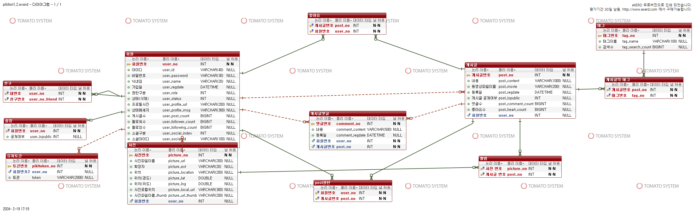

# PIKITORI

[Pikitori Card Video Manager](https://youtu.be/khK0P0s49hI)


이름 : Pikitori (Picture+Hisotry)
기간 : 2016. 10 ~ 2017.04

사용기술 및 라이브러리 : 
- Android
    - Media Controller
- **JDBC ( MyBatis )**
- **Spring framework**
    - Universal Image Loader ( Library )
    - Http-Request
- FFMPEG

개요 : 
 FFmpeg을 사용하여 이미지를 동영상으로 변환하고 배경음악을 넣어줍니다.

 1. 계정간 Follow을 통해 생성된 동영상을 공유.
 2. 수정권한을 받아, 이어서 Gif을 만들어 갈 수 있습니다.  

주요 기능 :
 - 로그인
 - 회원
 - 이미지 갤러리
 - GIF 생성
 - GIF 목록

명세서 : [pikitori1.ppt](http://naver.me/IDonbAmv)

## ERD




## Struct

```
├ db
├ app     // android source
├ server  // server source
├ doc
```

